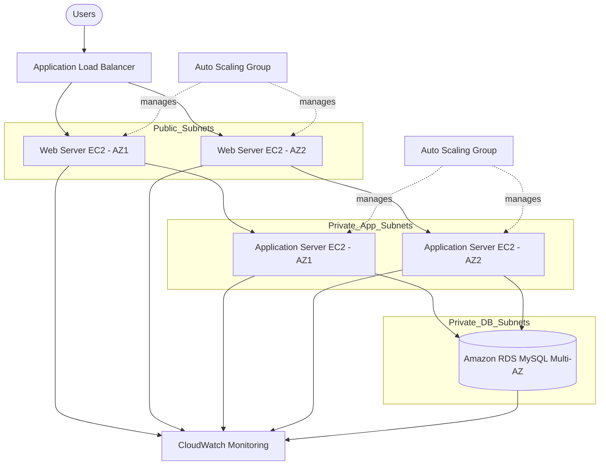

# AWS 3-Tier Architecture Diagram

```mermaid
flowchart TB

    User([Users])

    ALB[Application Load Balancer]

    subgraph Public_Subnets
        WEB1[Web Server EC2 - AZ1]
        WEB2[Web Server EC2 - AZ2]
    end

    subgraph Private_App_Subnets
        APP1[Application Server EC2 - AZ1]
        APP2[Application Server EC2 - AZ2]
    end

    subgraph Private_DB_Subnets
        RDS[(Amazon RDS MySQL Multi-AZ)]
    end

    User --> ALB

    ALB --> WEB1
    ALB --> WEB2

    WEB1 --> APP1
    WEB2 --> APP2

    APP1 --> RDS
    APP2 --> RDS

    ASG1[Auto Scaling Group]
    ASG2[Auto Scaling Group]

    ASG1 -. manages .-> WEB1
    ASG1 -. manages .-> WEB2

    ASG2 -. manages .-> APP1
    ASG2 -. manages .-> APP2

    CW[CloudWatch Monitoring]

    WEB1 --> CW
    WEB2 --> CW
    APP1 --> CW
    APP2 --> CW
    RDS --> CW
```
